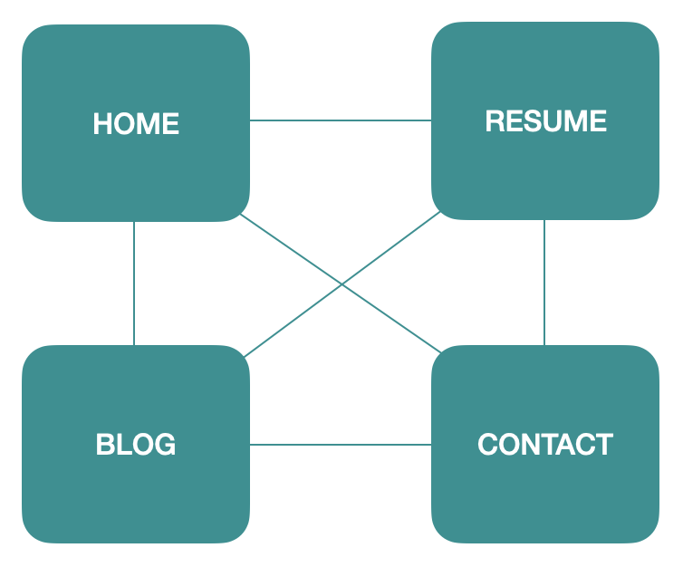

# **T1A2 - Portfolio**

CAS012100 - Arturo Caceres

Web Portfolio - https://pensive-pare-17220b.netlify.app/

## **Purpose**

The aim of this website is to display my abilities/skills, reflect my accomplishments, potential and overall my coding experience to prospective employers.

## **Functionality / Features**

- Access to social media
- Easy navigation
- List of blogs
- Send email to my personal account
- Trendy user experience
- Work Experience
- Coherent, neat and intuitive design
- Optimized for Mobile

## **Sitemap**

## **Screentshots**

### Home page

### Blogs page

### Resume page

### Contact page

## **Target audience**

This portfolio is targeted for Coder Acedemy Staff, prospective employers or collaborators, fellow students and/or any person interested on my coding skills.

## **Tech Stack**

- HTML
- CSS
- [Github](github.com) - Repository hosting
- [Netlify](https://www.netlify.com/) - App deployment

## **Resources**

- [Balsamiq](https://balsamiq.com/#) - Mocks/Wireframes
- [MDN Web Docs](https://developer.mozilla.org/en-US/) - General knowledge of components
- [W3School](https://www.w3schools.com/) - General knowledge of components
- [Image optimizer](http://www.imageoptimizer.net/Pages/Home.aspx)
- [W3C](https://validator.w3.org/) - HTML Validator
- [Font Awesome](https://fontawesome.com/) - Icons
- [Google Fonts](https://fonts.google.com/specimen/Nunito?preview.text_type=custom) - Fonts
- [Color Palettes](https://mycolor.space/?hex=%23F8F9FA&sub=1)
- [Avatar Maker](https://chrome.google.com/webstore/detail/avatar-maker/ofknlbikfofijlcjkfcihomkedmchfbn)
- [Shutterstock](https://www.shutterstock.com/home) - Stock images
- [SVG images](https://innovativewebservice.com/index.html) - SVG's used on site
- [Wave](https://wave.webaim.org/) - Web Accesability Tools
- [Google Lighthouse](https://developers.google.com/web/tools/lighthouse/) - Web Accesability Tools
- [SRI generator](https://laysent.github.io/sri-hash-generator/) - Used to generate SRI hashes
